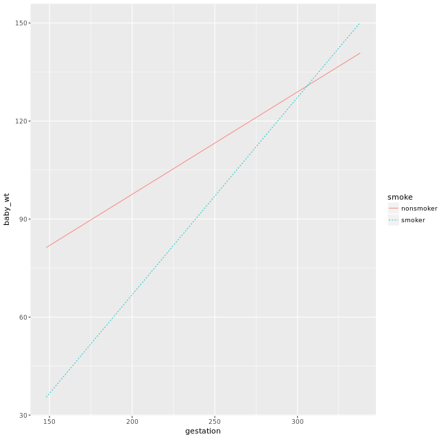

# Statistical Modeling in R (part 2)
## Chapter 1 - Effect size and interaction

To evaluate the model, need to set values for explanatory variables (commonly use mean, median, or mode).
To visualize the model, need to select several different levels of explanatory variables to include.

To streamline the process the `statisticalModeling` package provides 2 different functions:

1. `effect_size(model, formula, ...)` it calculates an effect size by scanning the data and finding appropriated values for the explanatory variable.
   
2. `fmodel(model,formula,data,type,...)` it lets you plot your model. The formula goes like this ~ x_var + color_var + plot_var. Response variable always on the y-axis. If the response is categorical it will plot the probability of the first category.

### Categorical responses variables
For a _quantitative response variable_ and a:
  - Quantitative explanatory variable, _effect size is a rate_
  - Categorical explanatory variable, _effect size is a difference_

But how to do in the case of a **Categorical response variable?**. There are 2 ways to frame the output:
1. As categories or classes
2. As probabilities

Changes on categorical variables are binary. It is one or nothing (this is relevant when it comes to credit risk analysis). This models are seen in "groups" and therefore we can calculate the probability for each individual to be part of that group.

After creating a model when can use, once again, `evaluate_model()` to calculate the probability for each class or to predict which class for each observation. The following code exemplifies:

```R
model_1 <- rpart(start_position ~ age + sex + nruns, 
                 data = Runners, cp = 0.001)

as_class <- evaluate_model(model_1, type = "class")
as_prob  <- evaluate_model(model_1)
```
On the `as_class` the category for each observation is the category with the highest probability.

> **Quote:** When the response variable is categorical, effect sizes are calculated using the probability of each possible output class. Since an effect size compares the model outputs for two different levels of the explanatory variables, each effect size is a difference in probability. Positive numbers mean that the probability increases from the base level to the to: level; negative numbers mean the the probability decreases.

There's a very important special case for classification: when the response variable has only two levels. Of course, you can use the recursive partitioning architecture, but **it's much more common in the two-level situation to use a technique known as logistic regression.**

> **Note from exercise** _Common sense suggests that survival changes continuously with age. **Recursive partitioning works best for sharp, discontinuous changes. Logistic regression can capture smooth changes**, and works better here._

### Interaction among explanatory variables
Effect size of one variable may change with to other explanatory variables. This is called and Interaction effect.

Interaction and model architecture:
- `lm()` includes interaction only if you ask for them. In order to ask for this interaction you change the formula when training the model. Instead of including explanatory variables using the + sign, we use * to represent interactions.
- `rpart()` has interactions built into the method

The inclusion of interaction can hurt or enhance a model. Therefore is must be tested. Code example:

```R
mod2: ~ year + sex
mod2: ~ year * sex

t.test(mse ~model, data = cv_pred_error(mod2,mod3))
```

In the linear model architecture, you specify an interaction between two explanatory variables by using `*` notation rather than `+`.

> Recall that an interaction describes how one explanatory variable (e.g. smoke) changes the effect size of the other (e.g. gestation).



> **Notes about the graph:** The following statements are true
> - The effect size of gestation is the slope of the model graph.
> - The effect size of smoke is the vertical offset from the smoker to the nonsmoker line.
> - No interaction between gestation and smoke could ever be seen in this (slightly different) model: baby_wt ~ gestation + smoke
> - The interaction between gestation and smoke can be seen in the difference in slopes between the smoker and nonsmoker lines. This is how smoke modulates the effect size of gestation.
> - The interaction between gestation and smoke can be seen in the changing vertical offset between the smoker and nonsmoker lines. This is how gestation modulates the effect size of smoke.

The t-test is a technique for comparing two sets of numbers. Here, the numbers are the cross validation prediction errors from the several trials.

### Total and partial change
The effect size quantifies the strength of a relationship between 2 variables.

```
Input x = 7 <-> Model M <-> Response Y = 3.2
Input x = 8 <-> Model M <-> Response Y = 3.5
```
${(3.5+3.2)\over(8-7)} = 0,3$

Being positive means that the response increases as the explanatory variable increases (it has a positive relation).

The magnitude of this relation depends, a lot, on the units used. If we want to compare we will have to convert them into the same units. example:

${-0.055\ dollars/ mile\ *\ 10000\ miles/year} = -550\ dollars/year$

When there are multiple inputs is easy to change them independently inside a model, nonetheless, in real life changing one variable often means changing other variables too because they are connected. 

### Total vs. partial change
**Partial change**: impact on the response of changing one input _holding all other inputs constant_

**Total change**: impact on the response of changing one input letting the _others change as they will_

Implication for model building:
- Partial change: includes all covariates that you want to hold constant while varying the explanatory variable
- Total change: exclude all covariates that you want to allow to change along the explanatory variable.

Note: this affects on the calculation of the formula for the function effect_size.

### R-squared

Correlation: r ("little r")
Coefficient of determination: R2